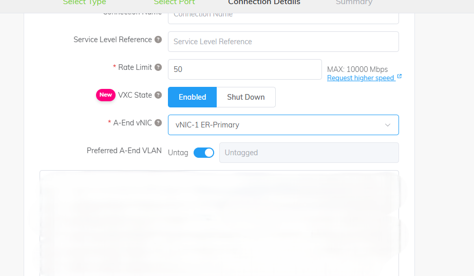
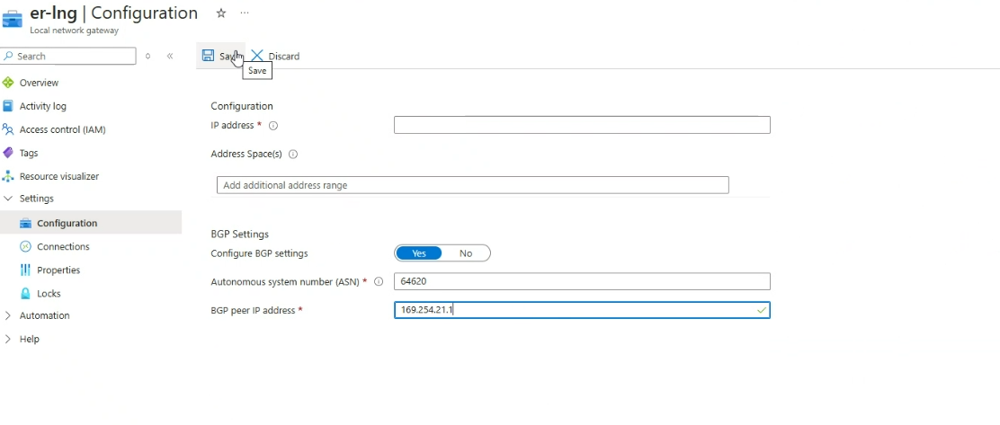
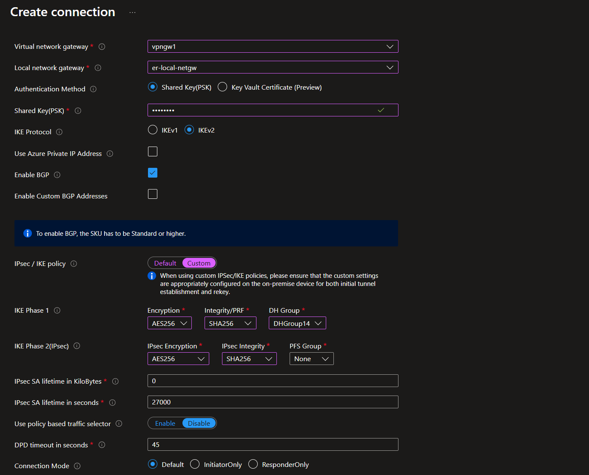

Welcome to ExpressRoute hands-on Lab!
=====================================

Table of Contents
=================

1. [Introduction](#1-introduction)

    1.1. [Prerequisites](#11-prerequisites)

    1.2. [Architecture](#12-architecture)

2. [Pre-work](#2-prework)

3. [Initial Configuration](#3-initial-router-configuration)

4. [Configure Azure ExpressRoute and Connect to ExpressRoute Gateway](#4-configure-azure-expressroute-and-connect-to-ergw)

5. [Build VPN Connection between On-Prem and Megaport](#5-build-vpn-connection-between-simulated-on-prem-environment-and-megaport)

6. [Understand ExpressRoute Insights and Monitoring Capabilities](#6-understand-monitoring-and-insights-capabilities-of-expressroute)

7. [Clean Up](#7-clean-up)

8. [Appendix A - CSR Configuration](#8-appendix-a---cisco-csr-8kv-configuration)


## 1. Introduction

In this lab we will be deploying 2 Azure environments.  One environment will simulate our 'On-Prem' network, and one will be our Azure Hub and Spoke deployment.

We will be provisioning an ExpressRoute circuit from Megaport, configuring a Cisco CSR 8000v router to bring up the circuit, and finally connecting it to Azure.  We will then configure a Site-to-Site VPN from the Cisco router at Megaport to connect our ExpressRoute to on-premise.

## 1.1 Prerequisites

This lab assumes you have an Azure subscription where you can deploy an ExpressRoute Gateway, ExpressRoute circuit, VPN gateway, Virtual Networks and Virtual Machines and all supporting resources (Public IPs for the gateways and Azure Bastion)

## 1.1.1. Helpful information to know ahead of time

- [Azure Networking Basics](https://learn.microsoft.com/en-us/azure/virtual-network/virtual-networks-overview)
- [Azure Routing](https://learn.microsoft.com/en-us/azure/virtual-network/virtual-networks-udr-overview)
- [Azure ExpressRoute](https://learn.microsoft.com/en-us/azure/expressroute/expressroute-introduction)
- [Azure VPN Gateway](https://learn.microsoft.com/en-us/azure/vpn-gateway/vpn-gateway-about-vpngateways)
- [Hub/Spoke Topology Concepts](https://learn.microsoft.com/en-us/azure/cloud-adoption-framework/ready/azure-best-practices/traditional-azure-networking-topology)

## 1.2 Architecture


## 2. Pre-work

**Step #1 - Deploy Simulated on-prem and Azure environments via templates**
  
1. **On-Prem**
   
   [](https://portal.azure.com/#create/Microsoft.Template/uri/https%3A%2F%2Fraw.githubusercontent.com%2Febizzity%2FExpressRouteTraining%2Frefs%2Fheads%2Fmain%2Fon-prem-templates%2FonpremEnvironment.json)
 
2. **Azure**
   
   [](https://portal.azure.com/#create/Microsoft.Template/uri/https%3A%2F%2Fraw.githubusercontent.com%2Febizzity%2FExpressRouteTraining%2Frefs%2Fheads%2Fmain%2Fazure-templates%2FazureEnvironment.json)

**Step #2 - Create Megaport ExpressRoute and MVE** (Instructor Only)

1. Login to Megaport Portal
2. Create MVE (Megaport Virtual Edge)
   1. Ensure we have enough interfaces (3 if doing full ER Resiliency)
   2. Generate SSH Key
   3. Add Megaport Internet to Primary interfaces

        - This will provision for a few minutes, when completed we will be able to get our Megaport public IP address and use it to log in to the Cisco router

        - Post-Deployment, get the public IP for each student's router and record it on a spreadsheet.

## 3. Initial Router Configuration
   
   1. Copy SSH Key into ~\\.ssh folder
   2. Login to Megaport MVE

        ```
        ssh -i .ssh\sshkey mveadmin@<Megaport_Public_IP>

        megaport-mve-97884#
        ```

3. Now we can begin configuring the route
4. Let's begin with checking our interfaces

    ```
    show ip int brief
    ```
    You should see output like the following:
    ```
    megaport-mve-97884#show ip int brief
    Interface              IP-Address      OK? Method Status                Protocol
    GigabitEthernet1       x.x.x.x         YES DHCP   up                    up
    GigabitEthernet2       unassigned      YES unset  administratively down down
    GigabitEthernet3       unassigned      YES unset  administratively down down
    ```

5. Next let's enter configuration mode and define our ExpressRoute interfaces

    ```
    conf t
    ```
    Paste the following configuration:
    ```
    interface GigabitEthernet2
    ip address 172.16.16.1 255.255.255.252
    negotiation auto
    vlan-id dot1q 800
    !
    bfd interval 300 min_rx 300 multiplier 3
    no shut
    !
    interface GigabitEthernet3
    ip address 172.16.16.5 255.255.255.252
    negotiation auto
    vlan-id dot1q 800
    !
    bfd interval 300 min_rx 300 multiplier 3
    no shut
    !
    ```
    Press Ctrl-Z

    Finally, check the interfaces and ensure they came up:
    ```
    megaport-mve-97884#show ip int brief
    Interface              IP-Address      OK? Method Status                Protocol
    GigabitEthernet1       x.x.x.x         YES DHCP   up                    up
    GigabitEthernet2       172.16.16.1     YES manual up                    up
    GigabitEthernet3       172.16.16.5     YES manual up                    up
    megaport-mve-97884#
    ```
       
## 4. Configure Azure ExpressRoute Private Peering and Connect to ERGW


1. Inspect the newly-deployed ExpressRoute ciruit created from the template above.
    
    

    Notice that we see a banner message indicating that we need to provision the circuit with the provider.

    Provide your service key to your instructor.

2. Instructor to provision ER Circuit.
    - Instructor to login to Megaport portal and create connection to MVE
    - Click Add Connection

        - 

    - Choose Cloud Connection

        - 

    - Choose Microsoft Azure

        - 

    - Enter the Service Key provided by student

        - 

    - Once they key is validated, Choose the Primary link of the circuit

        - 

    - Finally choose the interface on the MVE where we will connect the circuit and enter the student's vlan id, click ok, and click order.  You will now see the circuit in deploying status.
        - 
        - 
        - 

3. Provision the ER Private Peering

    1. Navigate to the ER circuit deployed from the template. 
        - Notice that the Private Peering is 'Not Provisioned'
    2. Click on the Private peering.
        - Configure the Peer ASN, Primary and Secondary Subnets, and the VLAN ID to match our Megaport router configuration.
        - 

3. Check MSEE reachability after peering provisioning is completed.

        ```
        megaport-mve-97884#ping 172.16.16.2
        Type escape sequence to abort.
        Sending 5, 100-byte ICMP Echos to 172.16.16.2, timeout is 2 seconds:
        !!!!!
        Success rate is 100 percent (5/5), round-trip min/avg/max = 1/1/1 ms
        megaport-mve-97884#ping 172.16.16.6
        Type escape sequence to abort.
        Sending 5, 100-byte ICMP Echos to 172.16.16.6, timeout is 2 seconds:
        !!!!!
        Success rate is 100 percent (5/5), round-trip min/avg/max = 1/1/1 ms
        ```
    
4. Configure BGP on CSR to peer with MSEE routers.
    - Log in to your Megaport Router and apply the following configuration.  Don't forget to enter configure mode! **Note:  you can copy and paste directly into the terminal**
    
    ```
    router bgp 64620
    bgp log-neighbor-changes
    neighbor 172.16.16.2 remote-as 12076
    neighbor 172.16.16.2 ebgp-multihop 255
    neighbor 172.16.16.2 update-source GigabitEthernet2
    neighbor 172.16.16.2 timers 5 20
    neighbor 172.16.16.2 fall-over bfd
    neighbor 172.16.16.6 remote-as 12076
    neighbor 172.16.16.6 ebgp-multihop 255
    neighbor 172.16.16.6 update-source GigabitEthernet3
    neighbor 172.16.16.6 timers 5 20
    neighbor 172.16.16.6 fall-over bfd
    !
    ```

5. Check BGP Peering Status on CSR 8kv:

    ```
    show ip bgp summ
    ```
    ```
    megaport-mve-97884#show ip bgp summ
    BGP router identifier 172.16.16.5, local AS number 64620
    BGP table version is 1, main routing table version 1

    Neighbor        V           AS MsgRcvd MsgSent   TblVer  InQ OutQ Up/Down  State/PfxRcd
    172.16.16.2     4        12076       5       5        1    0    0 00:01:08        0
    172.16.16.6     4        12076       4       2        1    0    0 00:00:19        0
    megaport-mve-97884#
    ```

6. At this point we are ready to connect the circuit to the ExpressRoute Gateway.  Perform the following steps:
    - Navigate to the ExpressRoute Gateway deployed from the templates above
    - Click Connections

        -  

    - Click Add
        -  

    - Choose the resource group you are leveraging for this lab and choose ExpressRoute for the Connection type.

        - 
    - For this lab, choose Standard Resiliency

        - 
    - Choose the ERGW, provide a name for the connection, choose the provisioned ER circuit and deploy.

        - 

7. Check for Routes from Azure on CSR 8kv:
    - Once the deployment for the connection has completed, we can go and check our received routes.  We should have routes for the Azure Hub, and the Azure Spoke, from both the Primary and Secondary circuits.
        ```
        show ip bgp
        ```
        ```
        megaport-mve-97884#show ip bgp
        BGP table version is 3, local router ID is 172.16.16.5
        Status codes: s suppressed, d damped, h history, * valid, > best, i - internal,
                    r RIB-failure, S Stale, m multipath, b backup-path, f RT-Filter,
                    x best-external, a additional-path, c RIB-compressed,
                    t secondary path, L long-lived-stale,
        Origin codes: i - IGP, e - EGP, ? - incomplete
        RPKI validation codes: V valid, I invalid, N Not found

            Network          Next Hop            Metric LocPrf Weight Path
        *    10.1.0.0/22      172.16.16.2                            0 12076 i
        *>                    172.16.16.6                            0 12076 i
        *    10.1.4.0/24      172.16.16.2                            0 12076 i
        *>                    172.16.16.6                            0 12076 i
        megaport-mve-97884#
        ```

## 5. Build VPN connection between Simulated On-Prem Environment and Megaport

1. We need some information from the VPN Gateway.  Go to the Azure portal and get the Public IP Address we are going to leverage for the connection as well as the BGP peering IP address.

    - Navigate to the VPN Gateway deployed from the templates above
        - Click Properties

            - 

            - Click Configure BGP

            -  

                - Note the IP Addresses down as we will need them in the next step

2. Log in to the Megaport CSR and enter the following configuration.  **NOTE: Be sure to update the placeholders with the appropriate IP addresses!**

    ```
    crypto ikev2 proposal Azure-Proposal
    encryption aes-cbc-256
    integrity sha1 sha256 sha384 sha512
    group 14 15 16
    !
    crypto ikev2 policy Azure-Policy
    match address local <MEGAPORT_PUBLIC_IP>
    proposal Azure-Proposal
    !
    !
    crypto ikev2 profile Azure-Profile
    match address local <MEGAPORT_PUBLIC_IP>
    match identity remote address <VPN_GATEWAY_PUBLIC_IP> 255.255.255.255
    authentication remote pre-share key VPNDEMO!
    authentication local pre-share key VPNDEMO!
    lifetime 28800
    dpd 10 5 on-demand
    !
    !
    !
    !
    !
    !
    !
    !
    !
    !
    !
    !
    !
    crypto ipsec transform-set Azure-TransformSet esp-aes 256 esp-sha256-hmac
    mode tunnel
    !
    crypto ipsec profile Azure-IPsecProfile
    set transform-set Azure-TransformSet
    set ikev2-profile Azure-Profile
    !
    !
    !
    !
    !
    !
    !
    !
    !
    !
    interface Tunnel11
    ip address 172.16.15.1 255.255.255.252
    ip tcp adjust-mss 1350
    tunnel source GigabitEthernet1
    tunnel mode ipsec ipv4
    tunnel destination <VPN_GATEWAY_PUBLIC_IP>
    tunnel protection ipsec profile Azure-IPsecProfile
    !
    ```

3. Configure BGP on the CSR to exchange routes between On-prem and Azure.

    ```
    router bgp 64620
    neighbor 10.20.2.62 remote-as 65515
    neighbor 10.20.2.62 ebgp-multihop 255
    neighbor 10.20.2.62 update-source Tunnel11
    neighbor 10.20.2.62 timers 5 20
    ```

4. Build VPN connection to Megaport in Azure
    - Create a net-new Local Network Gateway to represent the on-prem network in Azure.

    - Click Create

        -  

    - Choose the appropriate Resource Group, provide a name and the Public IP Address of the Megaport Router

        - 

    - Configure BGP Settings

        -   

    - Now, Navigate to the VPN Gateway, click Connections

        -  
        -  

    - Click Add

        -  

    - Choose Site-to-Site (IPSec) and the Connection Type and provide a name for the connection

        - 

    - Choose the VPN Gateway
    - Choose the Local Network Gateway created above
    - Provide the PSK from the config file above 
    - Click 'Enable BGP'

        - 

    - Choose custom IPsec/IKE Policy and use the following values:

        -  

5. Check BGP status on the Megaport router
    - Issue the following command on the router
        ```
        show ip bgp summary
        ```
    - Your output should look like this.  We're looking for the VPN Gateway peer to be Up.  We can see that below as 10.20.2.62 is Up for 11 seconds.

    -  

    - We can also issue the following command to see all of the BGP routes.  We should now see routes from ExpressRoute and 10.20.0.0/22 coming from the Simulated On-Prem environment.
        ```
        show ip bgp
        ```
6. Test Connectivity between on-prem and Azure.  
    - Login in to both Virtual Machines via Bastion.  Use the Username and Password you provided at the time of template deployment.
    - Enable the rule to allow ICMPv4 inbound via the "Windows Defender Firewall with Advanced Security" configuration tool.
    - Finally, ping and traceroute from each side to the VM on the other side.  We should see successful responses, feel free to test RDP or something else over the ER from one VM to another.
        - Note: If there is no reachability between the machines at this point we need to troubleshoot.  Please raise your hand and share your screen.

## 6. Understand Monitoring and Insights capabilities of ExpressRoute

1. View the ER Circuit Topology by viewing the insights page 

    - 

2. Explore the different available metrics on the ExpressRoute circuit

    - 
    - 
    - 
    - 

## 7. Clean up

1. Navigate to the ExpressRoute Gateway, Remove the connection we created above.
2. Navigate to your ExpressRoute circuit., Click on the Private peering's ellipsis and click delete.

    -     

3. Once your Private Peering configuration is deleted, inform your instructor so the circuit can be de-provisioned in the Megaport portal.

4. Once the circuit is de-provisioned, it should go back to looking like it did at the beginning of this training.

    -     

## 8. Appendix A - Cisco CSR 8kv configuration

```
crypto ikev2 proposal Azure-Proposal
 encryption aes-cbc-256
 integrity sha1 sha256 sha384 sha512
 group 14 15 16
!
crypto ikev2 policy Azure-Policy
 match address local <MEGAPORT_MVE_PIP>
 proposal Azure-Proposal
!
!
crypto ikev2 profile Azure-Profile
 match address local <MEGAPORT_MVE_PIP>
 match identity remote address <VPNGW_PIP> 255.255.255.255
 authentication remote pre-share key VPNDEMO!
 authentication local pre-share key VPNDEMO!
 lifetime 28800
 dpd 10 5 on-demand
!
!
!
!
!
!
!
!
!
!
!
!
!
crypto ipsec transform-set Azure-TransformSet esp-aes 256 esp-sha256-hmac
 mode tunnel
!
crypto ipsec profile Azure-IPsecProfile
 set transform-set Azure-TransformSet
 set ikev2-profile Azure-Profile
!
!
!
!
!
!
!
!
!
!
interface Tunnel11
 ip address 172.16.15.1 255.255.255.252
 ip tcp adjust-mss 1350
 tunnel source GigabitEthernet1
 tunnel mode ipsec ipv4
 tunnel destination <VPNGW_PIP>
 tunnel protection ipsec profile Azure-IPsecProfile
!
interface GigabitEthernet2
 ip address 172.16.16.1 255.255.255.252
 negotiation auto
 vlan-id dot1q 800
 !
 bfd interval 300 min_rx 300 multiplier 3
 no shut
!
interface GigabitEthernet3
 ip address 172.16.16.5 255.255.255.252
 negotiation auto
 vlan-id dot1q 800
 !
 bfd interval 300 min_rx 300 multiplier 3
 no shut
!
router bgp 64620
 bgp log-neighbor-changes
 neighbor 10.20.2.62 remote-as 65515
 neighbor 10.20.2.62 ebgp-multihop 255
 neighbor 10.20.2.62 update-source Tunnel11
 neighbor 10.20.2.62 timers 5 20
 neighbor 172.16.16.2 remote-as 12076
 neighbor 172.16.16.2 ebgp-multihop 255
 neighbor 172.16.16.2 update-source GigabitEthernet2
 neighbor 172.16.16.2 timers 5 20
 neighbor 172.16.16.2 fall-over bfd
 neighbor 172.16.16.6 remote-as 12076
 neighbor 172.16.16.6 ebgp-multihop 255
 neighbor 172.16.16.6 update-source GigabitEthernet3
 neighbor 172.16.16.6 timers 5 20
 neighbor 172.16.16.6 fall-over bfd
!
!
ip route 10.20.2.62 255.255.255.255 Tunnel11
!
```