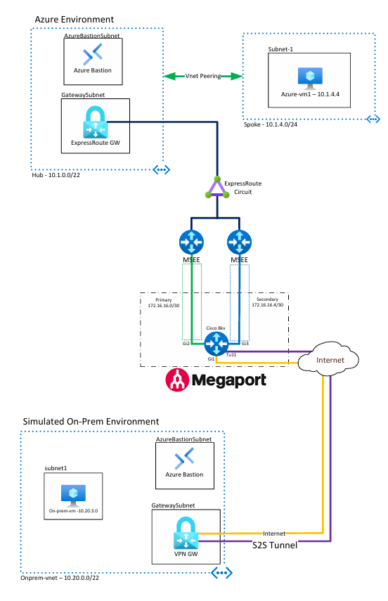

**Welcome to ExpressRoute hands-on Lab!**

In this lab we will be deploying 2 Azure environments.  One environment will simulate our 'On-Prem' network, and one will be our Azure Hub and Spoke deployment.

We will be provisioning an ExpressRoute circuit from Megaport, configuring a Cisco CSR 8000v router to bring up the circuit, and finally connecting it to Azure.  We will then configure a Site-to-Site VPN from the Cisco router at Megaport to connect our ExpressRoute to on-premise.

Architecture:



**Step #1 - Deploy Simulated on-prem and Azure environments via templates**
  
1. On-Prem
   
   [](https://portal.azure.com/#create/Microsoft.Template/uri/https%3A%2F%2Fraw.githubusercontent.com%2Febizzity%2FExpressRouteTraining%2Frefs%2Fheads%2Fmain%2Fon-prem-templates%2FonpremEnvironment.json)
 
2. Azure
   
   [](https://portal.azure.com/#create/Microsoft.Template/uri/https%3A%2F%2Fraw.githubusercontent.com%2Febizzity%2FExpressRouteTraining%2Frefs%2Fheads%2Fmain%2Fazure-templates%2FazureEnvironment.json)

**Step #2 - Create Megaport ExpressRoute and MVE**

1. Login to Megaport Portal
2. Create MVE (Megaport Virtual Edge)
   1. Ensure we have enough interfaces (3 if doing full ER Resiliency)
   2. Generate SSH Key
   3. Add Megaport Internet to Primary interfaces

   This will provision for a few minutes, when completed we will be able to get our Megaport public IP address and use it to log in to the Cisco router

   Megaport Public IP Picture

   4. Copy SSH Key into ~\.ssh folder
   5. Login to Megaport MVE

      ```
      ssh -i .ssh\sshkey mveadmin@<Megaport_Public_IP>
      
      megaport-mve-97884#
      ```

    6. Now we can begin configuring the router
    7. Let's begin with checking our interfaces

    ```
    megaport-mve-97884#show ip int brief
    Interface              IP-Address      OK? Method Status                Protocol
    GigabitEthernet1       x.x.x.x         YES DHCP   up                    up
    GigabitEthernet2       unassigned      YES unset  administratively down down
    GigabitEthernet3       unassigned      YES unset  administratively down down
    ```

    8. Next let's enter configuration mode and define our ExpressRoute interfaces

        ```
        megaport-mve-97884#conf t
        Enter configuration commands, one per line.  End with CNTL/Z.
        megaport-mve-97884(config)#interface gi2
        megaport-mve-97884(config-if)#ip address 172.16.16.1 255.255.255.252
        megaport-mve-97884(config-if)#no shut
        megaport-mve-97884(config-if)#vlan-id dot1q 800
        megaport-mve-97884(config-if-vlan-id)#interface gi3
        megaport-mve-97884(config-if)#ip address 172.16.16.5 255.255.255.252
        megaport-mve-97884(config-if)#no shut
        megaport-mve-97884(config-if)#vlan-id dot1q 800
        megaport-mve-97884(config-if-vlan-id)#^Z
        megaport-mve-97884#

        megaport-mve-97884#show ip int brief
        Interface              IP-Address      OK? Method Status                Protocol
        GigabitEthernet1       x.x.x.x         YES DHCP   up                    up
        GigabitEthernet2       172.16.16.1     YES manual up                    up
        GigabitEthernet3       172.16.16.5     YES manual up                    up
        megaport-mve-97884#
        ```
    9. Check MSEE Reachability from CSR 8kv:

        ```
        megaport-mve-97884#ping 172.16.16.2
        Type escape sequence to abort.
        Sending 5, 100-byte ICMP Echos to 172.16.16.2, timeout is 2 seconds:
        !!!!!
        Success rate is 100 percent (5/5), round-trip min/avg/max = 1/1/1 ms
        megaport-mve-97884#ping 172.16.16.6
        Type escape sequence to abort.
        Sending 5, 100-byte ICMP Echos to 172.16.16.6, timeout is 2 seconds:
        !!!!!
        Success rate is 100 percent (5/5), round-trip min/avg/max = 1/1/1 ms
        ```
    10. Check BGP Peering Status on CSR 8kv:

        ```
        megaport-mve-97884#show ip bgp summ
        BGP router identifier 172.16.16.5, local AS number 64620
        BGP table version is 1, main routing table version 1

        Neighbor        V           AS MsgRcvd MsgSent   TblVer  InQ OutQ Up/Down  State/PfxRcd
        172.16.16.2     4        12076       5       5        1    0    0 00:01:08        0
        172.16.16.6     4        12076       4       2        1    0    0 00:00:19        0
        megaport-mve-97884#
        ```

    11. Check for Routes from Azure on CSR 8kv:

        ```
        megaport-mve-97884#show ip bgp
        BGP table version is 3, local router ID is 172.16.16.5
        Status codes: s suppressed, d damped, h history, * valid, > best, i - internal,
                    r RIB-failure, S Stale, m multipath, b backup-path, f RT-Filter,
                    x best-external, a additional-path, c RIB-compressed,
                    t secondary path, L long-lived-stale,
        Origin codes: i - IGP, e - EGP, ? - incomplete
        RPKI validation codes: V valid, I invalid, N Not found

            Network          Next Hop            Metric LocPrf Weight Path
        *    10.1.0.0/22      172.16.16.2                            0 12076 i
        *>                    172.16.16.6                            0 12076 i
        *    10.1.4.0/24      172.16.16.2                            0 12076 i
        *>                    172.16.16.6                            0 12076 i
        megaport-mve-97884#
        ```

**Cisco CSR 8kv configuration:**

```
crypto ikev2 proposal Azure-Proposal
 encryption aes-cbc-256
 integrity sha1 sha256 sha384 sha512
 group 14 15 16
crypto ikev2 proposal On-Prem-Ikev2-Proposal
 encryption aes-cbc-256
 integrity sha1 sha256 sha384 sha512
 group 14 15 16
!
crypto ikev2 policy Azure-Policy
 match address local <MEGAPORT_PUBLIC_IP>
 proposal Azure-Proposal
!
!
crypto ikev2 profile Azure-Profile
 match address local <MEGAPORT_PUBLIC_IP>
 match identity remote address <VPN_GATEWAY_PUBLIC_IP> 255.255.255.255
 authentication remote pre-share key VPNDEMO!
 authentication local pre-share key VPNDEMO!
 lifetime 28800
 dpd 10 5 on-demand
!
!
!
!
!
!
!
!
!
!
!
!
!
crypto ipsec transform-set Azure-TransformSet esp-aes 256 esp-sha256-hmac
 mode tunnel
!
crypto ipsec profile Azure-IPsecProfile
 set transform-set Azure-TransformSet
 set ikev2-profile Azure-Profile
!
!
!
!
!
!
!
!
!
!
interface Tunnel11
 ip address 172.16.15.1 255.255.255.252
 ip tcp adjust-mss 1350
 tunnel source GigabitEthernet1
 tunnel mode ipsec ipv4
 tunnel destination <VPN_GATEWAY_PUBLIC_IP>
 tunnel protection ipsec profile Azure-IPsecProfile
!
interface GigabitEthernet1
 ip address dhcp
 speed 10000
 no negotiation auto
!
interface GigabitEthernet2
 ip address 172.16.16.1 255.255.255.252
 negotiation auto
 vlan-id dot1q 800
 !
!
interface GigabitEthernet3
 ip address 172.16.16.5 255.255.255.252
 negotiation auto
 vlan-id dot1q 800
 !
!
router bgp 64620
 bgp log-neighbor-changes
 neighbor 10.20.2.62 remote-as 65515
 neighbor 10.20.2.62 ebgp-multihop 255
 neighbor 10.20.2.62 update-source Tunnel11
 neighbor 172.16.16.2 remote-as 12076
 neighbor 172.16.16.2 ebgp-multihop 255
 neighbor 172.16.16.2 update-source GigabitEthernet2
 neighbor 172.16.16.6 remote-as 12076
 neighbor 172.16.16.6 ebgp-multihop 255
 neighbor 172.16.16.6 update-source GigabitEthernet3
!
ip route 10.20.2.62 255.255.255.255 Tunnel11

```